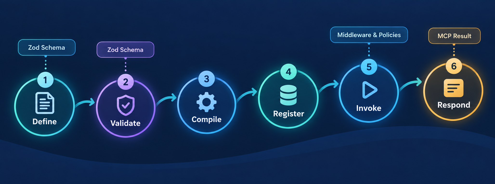

# Architecture

MCP Kernel is a reusable application layer between the official Model Context Protocol SDK and an application's domain integrations. It owns feature definitions, registration, lifecycle, middleware, execution policies, protocol results, transports, and test connections. A consuming application owns credentials, service clients, domain schemas, and business behavior.



## Dependency direction

Applications import the supported package root, `@coderrob/mcp-kernel`, and provide their dependencies through `createContext`. The kernel never imports application code.

```text
MCP client
  -> SDK transport
  -> MCP Kernel application
  -> application plugin and feature handler
  -> application-owned service client

application -> @coderrob/mcp-kernel -> @modelcontextprotocol/sdk
kernel -X-> application code
```

Only the package root is a supported consumer boundary. Internal source paths are deliberately absent from package exports so implementation modules can change without creating accidental public contracts.

## Definition and compilation

`defineTool`, `defineResource`, `defineResourceTemplate`, and `definePrompt` create immutable, schema-driven feature values. `definePlugin` groups related features and optional setup and disposal hooks. These helpers preserve the types inferred from Zod schemas without decorators, reflection, or a process-wide registry.

When `createMcpServer` constructs an application, the registry validates server identity, plugin and feature names, collisions, and tool-policy constraints. It then compiles a deterministic feature set and manifest. Invalid composition fails before a transport starts.

## Registration boundary

The SDK adapter is the only layer that translates compiled definitions into the official SDK registration API. It registers tools, resources, resource templates, and prompts while preserving their protocol schemas and metadata. This boundary isolates SDK integration details from feature authors and prevents SDK types from spreading through application code.

Tool input already validated by the SDK is not parsed a second time, so Zod transforms run once. Direct application invocations still validate their own input. Successful structured tool output is checked against the declared output schema.

## Lifecycle and context ownership

`createMcpServer` returns an isolated application instance. Starting it performs these steps in order:

1. create the application context;
2. run plugin setup hooks in declaration order;
3. create the SDK server and register compiled features; and
4. connect the selected transport.

Stopping aborts the application signal, closes the SDK server, disposes initialized plugins in reverse order, and disposes the context. Stop is idempotent and terminal. Startup failures roll back resources that the kernel successfully initialized; a plugin whose own setup throws remains responsible for partially acquired resources.

Handlers receive validated input, the application context, and request metadata. The metadata identifies the request, plugin, feature, transport, start time, cancellation signal, and optional principal.

## Invocation pipeline

Middleware wraps a feature invocation in declaration order and may observe, short-circuit, or delegate it. Tool policies run within the application boundary:

- required scopes authorize a principal before cached data can be returned;
- per-principal rate limits include cache hits;
- read-only result caches support time-to-live, capacity, principal variation, and tagged invalidation;
- timeouts signal cooperative cancellation; and
- application shutdown propagates cancellation to active work.

Policy state is local to one application instance. It is useful for bounded process-level controls and does not replace distributed authorization, rate limiting, or caching when those guarantees are required.

## Results, errors, and logging

Feature handlers return native MCP results. `jsonResult`, `textResult`, and `errorResult` provide common tool-result shapes. Typed `McpHarnessError` failures preserve declared caller-safe details; unexpected failures are sanitized and correlated with a request ID.

For stdio servers, stdout belongs to JSON-RPC. `createStderrLogger` keeps operational logs on stderr and redacts sensitive structured field names. Applications must still avoid putting secrets in free-form messages.

## Transports and tests

`stdioTransport` supplies the packaged stdio boundary, while `defineTransport` adapts another official SDK transport factory. Transport authentication metadata supplies the principal identity and scopes used by tool policies; the kernel does not authenticate credentials itself.

`connectTestClient` connects an official SDK client and server through linked in-memory transports. It exercises protocol discovery and calls without launching a child process, and it owns cleanup when connection or client shutdown fails. Consuming applications should add process-level tests for their packaged transport and domain integrations.

See [Getting started](getting-started.md) for a working composition example and [Runtime and policies](runtime.md) for detailed policy semantics and operational limits.
